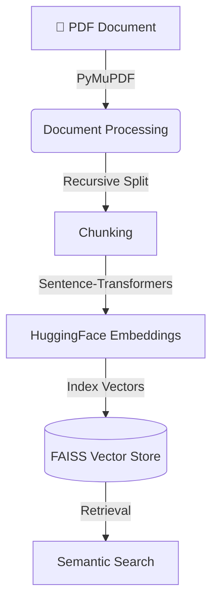

# GA03: Research Paper Management & Analysis Intelligence System

## 📌 Overview
This project implements a Research Paper Intelligence System that helps users ingest academic research papers, generate semantic embeddings, and perform semantic search using Retrieval-Augmented Generation (RAG) principles.

The system is designed to handle long-form academic PDFs and enable efficient discovery of relevant content without reading the entire paper.

---

## 🎯 Objectives
- Ingest research paper PDFs
- Split documents into semantic chunks
- Generate embeddings using HuggingFace models
- Index embeddings using FAISS
- Perform semantic search over research papers

---

## 🧱 Project Architecture

## 🛠 Tech Stack
Language: Python

Orchestration: LangChain

Embeddings: HuggingFace Sentence Transformers

Vector DB: FAISS

Parsing: PyMuPDF

Package Manager: uv (virtual environment & dependency management)

## 📂 Project Structure
GA03-Research-Paper-RAG/
│
├── config/
│   └── settings.py
│
├── core/
│   ├── document_processor.py
│   ├── embeddings.py
│   ├── vector_store.py
│   └── schema.py
│
├── data/
│   ├── papers/
│   └── vectorstore/
│
├── ingest.py
├── main.py
├── requirements.txt
└── README.md

## ⚙️ Setup Instructions
### 1️⃣ Clone the Repository

git clone [https://github.com/Rishabhjain011/GA03-Research-Paper-RAG.git](https://github.com/Rishabhjain011/GA03-Research-Paper-RAG.git)
cd GA03-Research-Paper-RAG

### 2️⃣ Create Virtual Environment (using uv)

pip install uv
uv venv

# Activate the environment:
# Windows
.venv\Scripts\activate
# Mac/Linux
source .venv/bin/activate

### 3️⃣ Install Dependencies

uv pip install -r requirements.txt

### 4️⃣ Environment Variables
Create a .env file in the project root: 
GROQ_API_KEY=your_groq_api_key
HUGGINGFACE_API_KEY=your_huggingface_api_key
LLM_MODEL=llama3-70b-8192
LLM_TEMPERATURE=0.1
EMBEDDING_MODEL=sentence-transformers/all-mpnet-base-v2
CHUNK_SIZE=1000
CHUNK_OVERLAP=200
FAISS_INDEX_PATH=data/vectorstore/faiss
TOP_K_RESULTS=5

# ⚠️ Note: .env is excluded from Git for security reasons.

## ▶️ How to Run the Project
### 📥 Ingest a Research Paper
Place a PDF file inside: data/papers/

Run ingestion:

uv run python ingest.py

This will:

Load the PDF

Chunk the text

Generate embeddings

Store vectors in FAISS

### 🔍 Perform Semantic Search
Run the main script to query your document:
uv run python main.py

### 🧪 Example Queries:
"What problem does the paper address?"

"What methodology is proposed?"

"What are the key findings?"

"What experiments were conducted?"

## 🔐 Security & Best Practices
API keys are managed using environment variables.

.env, .venv, and generated vector stores are excluded from version control.

Repository contains only clean, reproducible source code.

## 🚧 Current Limitations
Supports single-paper ingestion.

Basic metadata extraction.

No citation graph analysis.

No UI (CLI-based interaction only).

## 🚀 Future Enhancements
[ ] Multi-paper ingestion

[ ] Citation and reference analysis

[ ] RAG-based answer generation using LLMs

[ ] Streamlit-based user interface

[ ] Research trend analysis across multiple papers

## 🎓 Conclusion
This project demonstrates a complete end-to-end Research Paper Intelligence System using modern RAG techniques, vector databases, and secure engineering practices. It showcases how AI can significantly improve academic research workflows by enabling fast and intelligent access to information.

Explanation video link :- https://drive.google.com/file/d/1844qazCpO4v4EqWjMtMjMCs1eISMWuds/view?usp=drive_link
